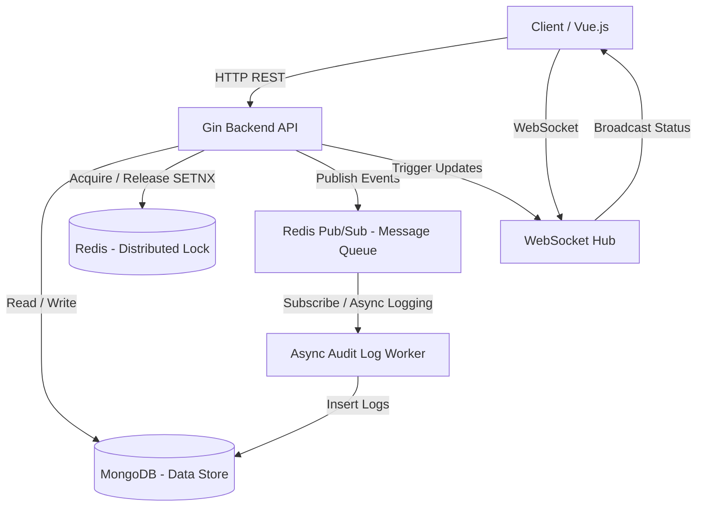

# Cinema Ticket Booking System - Backend

โปรเจกต์ Backend สำหรับระบบจองตั๋วโรงภาพยนตร์ (Take-Home Assignment) พัฒนาด้วยภาษา Go โดยเน้นไปที่การจัดการ Concurrency ป้องกันการเกิด Double Booking และมีการอัปเดตสถานะแบบ Real-time

---

## 1. System Architecture Diagram



---

## 2. Tech Stack Overview

- **Language:** Go (Golang)
- **Framework:** Gin (สำหรับทำ RESTful API)
- **Database:** MongoDB (เก็บข้อมูลผังที่นั่ง, สถานะการจอง, ข้อมูลผู้ใช้ และ Audit Logs)
- **Cache & Distributed Lock:** Redis
- **Message Queue:** Redis Pub/Sub (ประยุกต์ใช้เพื่อทำ Async Task)
- **Real-time:** Gorilla WebSocket
- **Authentication:** Google OAuth 2.0 / JWT Token

---

## 3. Booking Flow 

1. **Get Seats:** Client เรียก API `GET /api/v1/seats` เพื่อดึงผังที่นั่งปัจจุบัน ระบบจะคืนค่าสถานะ (AVAILABLE, LOCKED, BOOKED) 
2. **Select & Lock:** เมื่อผู้ใช้กดเลือกที่นั่ง ระบบจะยิง API `POST /api/v1/seats/lock`
   - Backend จะทำการขอสิทธิ์ **Distributed Lock** ผ่าน Redis (ดูหัวข้อ 4)
   - หากได้ Lock ระบบจะอัปเดตสถานะใน MongoDB เป็น `LOCKED` พร้อมบันทึก `user_id`
   - ส่งสัญญาณผ่าน WebSocket เพื่อให้ Client เครื่องอื่นๆ อัปเดตผังที่นั่งแบบ Real-time ทันที
3. **Timeout Check (5 นาที):** Backend จะเริ่มรัน Goroutine นับถอยหลัง 5 นาที หากผู้ใช้คนเดิมไม่ทำรายการชำระเงินให้สำเร็จ ระบบจะเคลียร์ Lock ใน Redis และเปลี่ยนสถานะกลับเป็น `AVAILABLE` ใน MongoDB
4. **Confirm Payment:** หากผู้ใช้ชำระเงินทันเวลา (เรียก API `POST /api/v1/seats/confirm`)
   - เปลี่ยนสถานะที่นั่งเป็น `BOOKED` 
   - ลบ Lock ออกจาก Redis
   - ส่งสัญญาณ Message Queue (Redis Pub/Sub) เพื่อไปบันทึก Audit Log ลง DB แบบ Async (ดูหัวข้อ 5)
   - ส่ง LINE Notification แจ้งเตือนผู้ใช้งาน

---

## 4. Redis Lock Strategy

ใช้ **Redis `SETNX` (Set if Not eXists)** เพื่อทำ Distributed Lock โดยมีจุดประสงค์หลักเพื่อป้องกันปัญหา **Double Booking** (ผู้ใช้ 2 คนกดจองที่นั่งเดียวกัน)

- **Lock Key format:** `lock:show:<show_id>:seat:<seat_no>`
- **Lock Value:** `user_id` (เพื่อให้รู้ว่าใครเป็นเจ้าของ Lock นี้ และป้องกันไม่ให้คนอื่นมาคลาย Lock)
- **TTL (Time to Live):** 5 นาที

**กลไกการทำงาน:**
`SETNX` จะคืนค่า `true` เฉพาะกรณีที่ Key นี้ยังไม่เคยมีในระบบเท่านั้น ทำให้การันตีในระดับ Atomic Operation ว่าถึงแม้จะมี Request เข้ามาพร้อมกัน 1,000 Request จะมีแค่ 1 Request เท่านั้นที่ได้สิทธิ์ครอบครองที่นั่งนี้ ส่วนคนที่เหลือจะได้ Error 409 Conflict กลับไป

---

## 5. Message Queue ใช้ทําอะไร

โปรเจกต์นี้เลือกใช้ **Redis Pub/Sub** เป็นตัว Message Queue โดยประยุกต์ใช้ใน Use Case: **Async Audit Logging**

**ปัญหา:** การบันทึกประวัติการกระทำ (เช่น การล็อกสำเร็จ, การหลุดล็อก, การชำระเงิน) ลง Database ค่อนข้างกินทรัพยากรและทำให้ HTTP Request ตอบสนองช้าลง
**วิธีแก้:** เมื่อเกิด Event สำคัญ ระบบจะ Publish Message โยนเข้า Redis Channel แล้วปล่อยให้ HTTP Request ตอบกลับผู้ใช้ทันที (Fire and Forget) จากนั้นจะมี Background Worker ใน Go ที่ทำหน้าที่ Subscribe Channel คอยดึงข้อความเหล่านั้นไปบันทึกลง MongoDB ทีหลังแบบ Asynchronous

---

## 6. วิธีรันระบบ

เนื่องจากโปรเจกต์จัดการด้วย Docker ทำให้สามารถรันทั้งระบบฐานข้อมูลและเซิร์ฟเวอร์ได้ด้วยคำสั่งเดียว:

```bash
docker compose up -d --build
```
- Backend API จะรันอยู่ที่: `http://localhost:8080`
- MongoDB จะรันอยู่ที่พอร์ต `27017`
- Redis จะรันอยู่ที่พอร์ต `6379`

---

## 7. Assumptions & Trade-offs

- **Redis Pub/Sub vs Kafka/RabbitMQ:** เลือกลดทอนความซับซ้อนโดยใช้ Redis Pub/Sub ซึ่งมี Trade-off คือหาก Worker ตาย Message ที่ค้างอยู่ในคิว ณ ตอนนั้นจะสูญหาย (ไม่ Persist เหมือน Kafka) แต่แลกมาด้วยความเบาและไม่ต้องพึ่งพา Infrastructure หลายตัว
- **Timeout Implementation:** การนับถอยหลัง 5 นาที ปัจจุบันใช้ Go Channel / `time.Sleep` ภายใน Memory หากเซิร์ฟเวอร์ Restart ระหว่างที่นับอยู่ Goroutine จะตายไป อย่างไรก็ตาม Redis Lock มี TTL ผูกไว้อยู่แล้ว มันจะคลายล็อกเองโดยธรรมชาติ เพียงแต่สถานะใน MongoDB จะไม่ถูกอัปเดตกลับเป็น AVAILABLE (สำหรับ Production อาจพิจารณาใช้ Redis Keyspace Notifications แทน)
- **Payment Gateway:** ทำการจำลองเส้นทาง (Mock) โดยถือว่าการยิงมาที่ `/seats/confirm` คือการชำระเงินสำเร็จ

---

## 8. วิธีการทดสอบ

สามารถทดสอบได้ 2 ทาง:
1. **ผ่าน Frontend UI:** เปิดเบราว์เซอร์ 2 หน้าจอ จำลองผู้ใช้ 2 คน (ใช้ Mock Auth) และกดแย่งจองที่นั่งเดียวกัน
2. **ผ่าน API (Postman / cURL):** ยิง API `/seats/lock` พร้อมกัน 2 ครั้งเพื่อทดสอบ Distributed Lock

การทำ **Mock Login (สำหรับ Testing)**
- ไปที่: `http://localhost:8080/api/v1/auth/mock-choice`
- เลือกล็อกอินด้วยบัญชีจำลอง ระบบจะ Generate JWT Token ให้เพื่อนำไปใช้ใน Postman

---

## 9. Simple Test Case

| Test Case | Step | Expected Result |
| :--- | :--- | :--- |
| **1. Lock Success** | User A ยิง `POST /seats/lock` ที่นั่ง `A1` | HTTP 200 OK, ที่นั่ง `A1` เปลี่ยนเป็น `LOCKED` |
| **2. Double Booking** | User B ยิง `POST /seats/lock` ที่นั่ง `A1` ในระหว่างที่ A ล็อกอยู่ | HTTP 409 Conflict, แจ้งเตือนว่ามีคนจองแล้ว |
| **3. Timeout Release** | User A รอ 5 นาทีโดยไม่ชำระเงิน | ที่นั่ง `A1` จะเปลี่ยนสถานะกลับเป็น `AVAILABLE` อัตโนมัติ |
| **4. Payment Success** | User A ยิง `POST /seats/confirm` ที่นั่ง `A1` ภายใน 5 นาที | HTTP 200 OK, ที่นั่ง `A1` เปลี่ยนเป็น `BOOKED` |
| **5. Cross Payment** | User B ยิง `POST /seats/confirm` ที่นั่ง `A1` (ที่ A เป็นคนล็อกไว้) | HTTP 403 / 400 Bad Request, ไม่สามารถจ่ายแทนกันได้ |

---

## 10. วิธีการยิง API ด้วย Postman Collection

1. นำ Token ฝั่งผู้ใช้ ไปใส่ใน Postman แท็บ **Authorization -> Bearer Token**
2. ตั้งค่า Body เป็น JSON Format

**API 1: จอง/ล็อกที่นั่ง (Lock Seat)**
- **Method:** `POST`
- **URL:** `http://localhost:8080/api/v1/seats/lock`
- **Body:**
  ```json
  {
      "show_id": "spider-man",
      "seat_no": "A1"
  }
  ```

**API 2: ยืนยันการชำระเงิน (Confirm Payment)**
- **Method:** `POST`
- **URL:** `http://localhost:8080/api/v1/seats/confirm`
- **Body:**
  ```json
  {
      "show_id": "spider-man",
      "seat_no": "A1"
  }
  ```